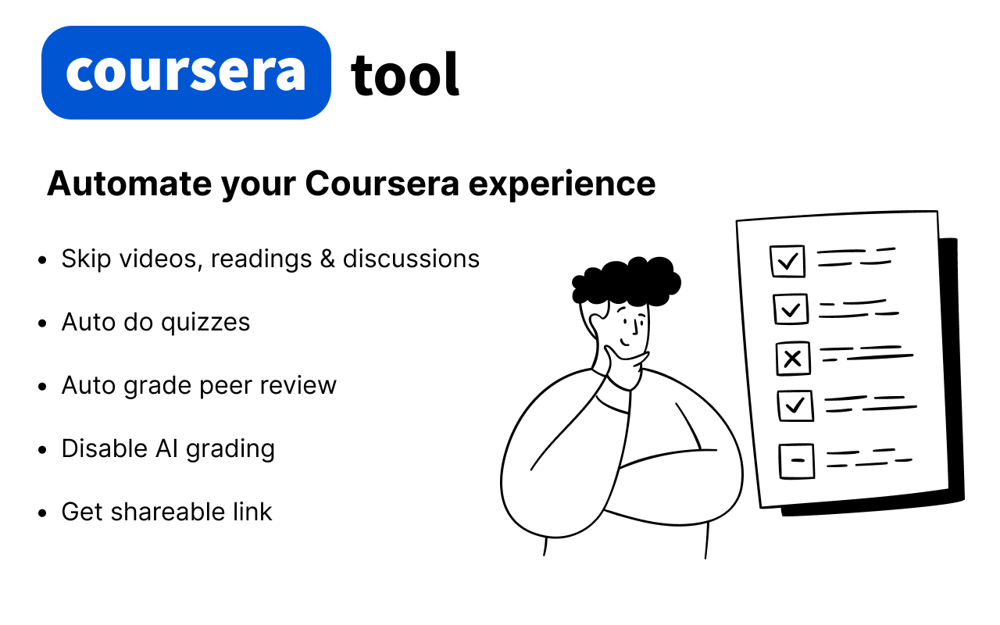

# 🎓 Coursera Tool Extension

A comprehensive browser extension designed to enhance your Coursera learning experience through intelligent automation features. Built **for educational purposes only** to help students and professionals manage their coursework more efficiently.

> ⚠️ **Important Notice:** This tool is intended for educational and research purposes. Users should ensure compliance with Coursera's Terms of Service and use the tool responsibly and ethically.

## 🚀 What This Extension Does

This powerful automation tool provides comprehensive assistance across all aspects of Coursera courses:

### ✨ Core Features

| Feature | Description | Time Saved |
|---------|-------------|------------|
| 📑 **Video & Reading Automation** | Auto-complete all videos and reading sections | 100% |
| 💯 **Smart Quiz Assistant** | Gemini-powered auto-answer for quizzes | 80-95% |
| 🧑 **Assignment Helper** | Auto-submit peer-graded assignments | 70-90% |
| 📋 **Submission Management** | One-click copy of your submission links | 100% |
| ✅ **Peer Review Automation** | Auto-grade with highest scores for peer submissions | 90% |
| 🤖 **Grading Options** | Switch between AI grading and peer grading | 90% |
| 📊 **Progress Tracking** | Monitor course completion status | - |
| 🗣️ **Discussion Participation** | Generate meaningful forum contributions | 95% |

> ⚠️ **Caution:** Auto-quiz feature might not always provide 100% accurate answers, and auto-submit feature may occasionally not work as expected.

## 📦 Installation Options

### 🛠 Option 1: Manual Installation (Chrome & Others)

1. Download the latest `build.zip` from the [Releases Page](https://github.com/Pear104/coursera-tool/releases)
2. Extract the contents to a folder
3. Open Chrome and navigate to `chrome://extensions/`
4. Enable **Developer Mode** (top-right toggle)
5. Click **"Load unpacked"**
6. Select the extracted folder

📘 Need help? Follow this [detailed installation guide](https://ui.vision/howto/install-chrome-extension-from-file)

### 🎯 Option 2: Premium Version

For advanced features and dedicated support:
- **Contact:** 9277.dev@gmail.com
- **Pricing:** $10 per course (one-time payment)
- **Benefits:** Enhanced automation, priority support, custom solutions
- **Setup:** Personalized onboarding included

## 🖼 Screenshots & Preview

### 😱 Special Features for FPT Students

## 🛠️ Technology & Architecture

Built with modern web technologies for reliable performance:

- **Advanced Automation:** Seamless integration with Coursera's platform
- **Secure Browser Integration:** Privacy-focused local operation
- **Responsive Design:** Compatible with all Coursera course formats
- **Comprehensive Database:** Extensive quiz answer repository
- **Minimal Permissions:** Only essential browser permissions required

## 💼 Ideal For

- **Busy Professionals:** Balancing work and continuing education
- **Students:** Managing multiple courses with tight deadlines
- **Lifelong Learners:** Focusing on content over busy work
- **Certificate Seekers:** Completing requirements efficiently
- **Course Evaluators:** Quickly assessing course quality and content

## 🔒 Privacy & Security

Your privacy is our priority:

- ✅ **No Data Collection:** Your information stays completely private
- ✅ **Local Processing:** All operations run in your browser
- ✅ **No Login Required:** Works with your existing Coursera account
- ✅ **Minimal Permissions:** Only necessary browser access
- ✅ **Secure Architecture:** Privacy-focused design principles

## 💲 Pricing Options

### Free Version
- Basic automation features
- Community support
- Standard functionality

### Premium Version ($10/course)
- **Complete Automation Suite:** All features unlocked
- **Priority Support:** 24-hour response time
- **Custom Solutions:** Tailored for specific requirements
- **Volume Discounts:** Special rates for multiple courses
- **Personalized Onboarding:** Setup guidance included

**Contact 9277.dev@gmail.com for pricing and custom plans**

## ⚠️ Educational Purpose & Responsible Use

This extension is provided for educational and research purposes to understand browser automation and web scraping techniques. Users should:

- ✅ Ensure compliance with Coursera's Terms of Service
- ✅ Use the tool responsibly and ethically
- ✅ Focus on learning the material, not just certification
- ✅ Consider this as a learning aid, not a replacement for education
- ✅ Don't misuse this for official work or certificates where personal completion matters

## 📞 Support & Contact

**Community Support:**
- 🐞 [Report Issues on GitHub](https://github.com/Pear104/coursera-tool/issues)
- 💬 [Facebook Support](https://www.facebook.com/profile.php?id=100074006097767)

**Premium Support:**
- 📧 **Email:** 9277.dev@gmail.com
- ⏱️ **Response Time:** Within 24 hours
- 🛠️ **Included:** Setup guidance and troubleshooting
- 🎯 **Custom Solutions:** Available for specific requirements

## ☕ Support the Project

This extension is **100% free** for the community. If you find it valuable:

- ⭐ **Star the repository** on GitHub
- 💬 **Leave feedback** and reviews
- [☕ **Buy me a coffee**](https://coff.ee/phamquangvinh)
- 🔄 **Share with fellow learners**

> Every gesture of support, whether a coffee or a kind comment, keeps this project alive and evolving. Thank you!

## 🔄 Updates & Maintenance

We continuously improve the extension with:

- 🆕 **New Features:** Based on user feedback and requests
- 🔄 **Platform Updates:** Maintaining Coursera compatibility
- 📈 **Enhanced Database:** Expanding quiz answer coverage
- ⚡ **Performance Optimizations:** Faster and more reliable automation
- 🔒 **Security Updates:** Maintaining privacy and safety standards

## 🤝 Contributing

Contributions are welcome! Please feel free to submit pull requests, report bugs, or suggest new features.

## 📄 License

This project is licensed under the MIT License - see the LICENSE file for details.

---

**Developed with ❤️ by the open-source community**
*Original concept from FPT • Enhanced and maintained by 9277.dev@gmail.com*

**Keywords:** Coursera automation, course completion tool, educational browser extension, quiz solver, assignment helper, video skipper, peer review automation, study productivity, learning efficiency
